---
## Front matter
lang: ru-RU
title: "Лабораторная работа №4: Модель гармонических колебаний"
subtitle: "*дисциплина: Математическое моделирование*"
author: "Голова Варвара Алексеевна"
date: 2021, 05 March

##output:  
  ##word_document:
    ##toc: true
    ##pandoc_args: [
      ##"-H", "template.latex"
    ##]

## Formatting
toc: false
slide_level: 2
theme: metropolis
header-includes:
 - \metroset{progressbar=frametitle,sectionpage=progressbar,numbering=fraction}
 - '\makeatletter'
 - '\beamer@ignorenonframefalse'
 - '\makeatother'
aspectratio: 43
section-titles: true

---

# Цель работы

Ознакомиться с моделью гармонических колебаний и построить фазовые портреты гармонического осциллятора по этой модели.

# Задание

Построить фазовый портрет гармонического осциллятора и решение уравнения гармонического осциллятора на интервале $t\in[0;56]$
(шаг $0.05$) с начальными условиями $x_0=0.9, y_0=1.9$ для следующих случаев:
1. Колебания гармонического осциллятора без затуханий и без действий внешней силы $\ddot{x}+4.7x=0$

2. Колебания гармонического осциллятора c затуханием и без действий внешней силы $\ddot{x}+0.5\dot{x}+7x=0$

3. Колебания гармонического осциллятора c затуханием и под действием внешней силы $\ddot{x}+7\dot{x}+0.5x=0.5sin(0.7t)$

# Выполнение лабораторной работы

## Библиотеки

Подключаю все необходимые библиотеки(рис. -@fig:001).

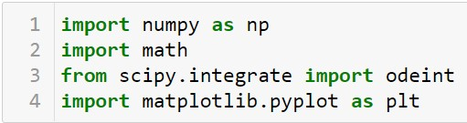{ #fig:001 width=70% }

## Значения
Ввод значений из своего варианта (28 вариант)(рис. -@fig:002).

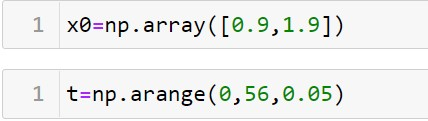{ #fig:002 width=70% }

## Задание №1
Ввод параметров осциллятора для задания №1(рис. -@fig:003).

{ #fig:003 width=70% }

Функция f для задания №1(рис. -@fig:004).

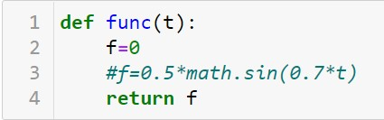{ #fig:004 width=70% }

## Задание №1
Система для задания №1(рис. -@fig:005).

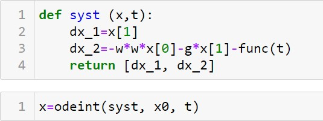{ #fig:005 width=70% }

## Вывод задания №1
Вывод фазового портрета гармонических колебаний для задания №1(рис. -@fig:006).

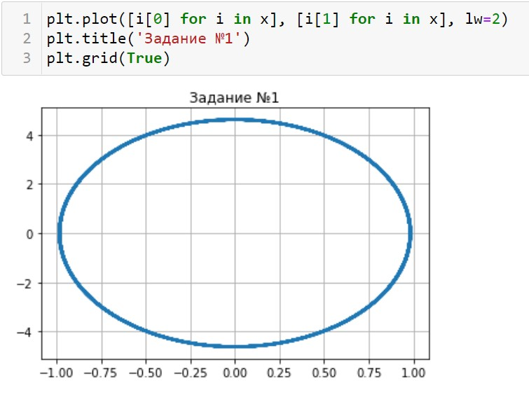{ #fig:006 width=70% }

Вывод решения уравнения гармонического осциллятора для задания №1(рис. -@fig:007).

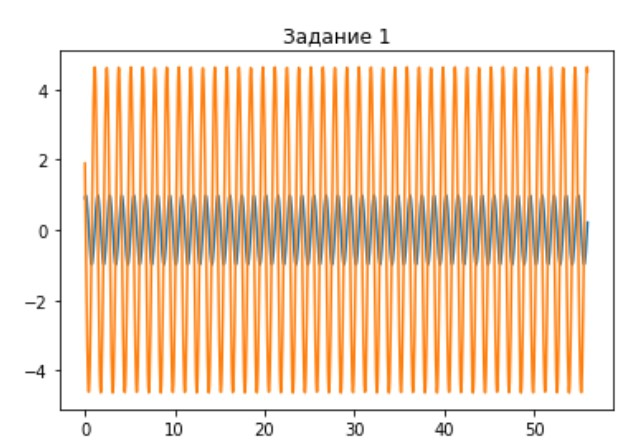{ #fig:007 width=70% }

## Задание №2
Ввод параметров осциллятора для задания №2(рис. -@fig:008).

{ #fig:008 width=70% }

Функция f для задания №2(рис. -@fig:009).

{ #fig:009 width=70% }

## Задание №2
Система для задания №2(рис. -@fig:010).

{ #fig:010 width=70% }

## Вывод задания №2
Вывод фазового портрета гармонических колебаний для задания №2(рис. -@fig:011).

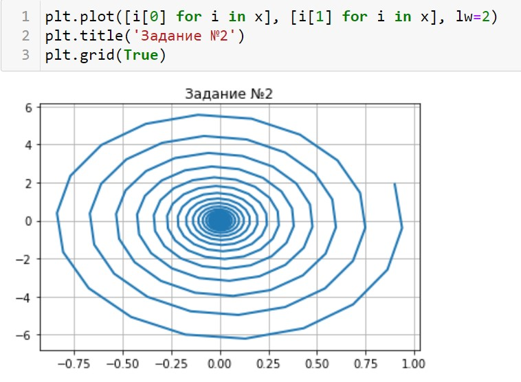{ #fig:011 width=70% }

Вывод решения уравнения гармонического осциллятора для задания №2(рис. -@fig:012).

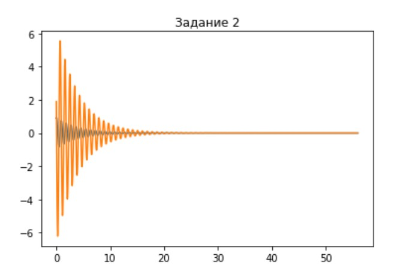{ #fig:012 width=70% }

## Задание №3
Ввод параметров осциллятора для задания №3(рис. -@fig:013).

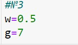{ #fig:013 width=70% }

## Заание №3
Функция f для задания №3(рис. -@fig:014).

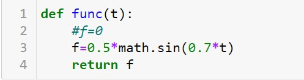{ #fig:014 width=70% }

## Задание №3
Система для задания №3(рис. -@fig:015).

{ #fig:015 width=70% }

## Вывод задания №3
Вывод фазового портрета гармонических колебаний для задания №3(рис. -@fig:016).

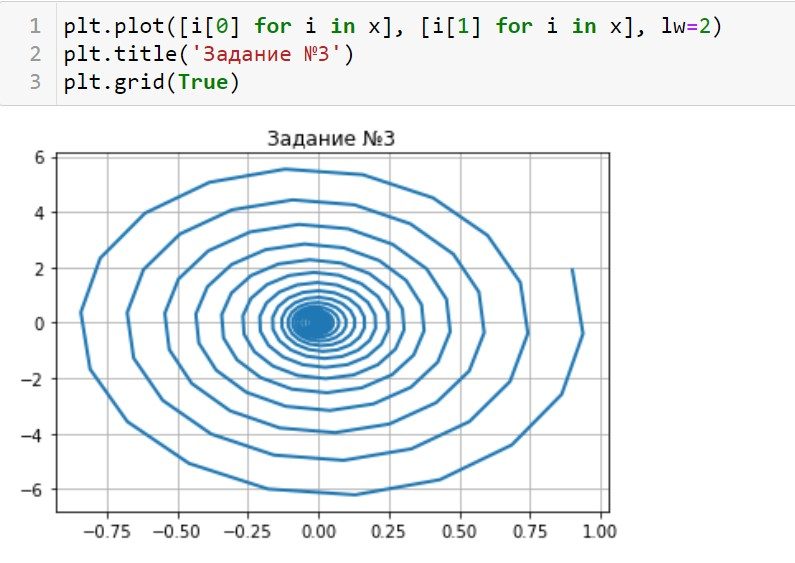{ #fig:016 width=70% }

Вывод решения уравнения гармонического осциллятора для задания №3(рис. -@fig:017).

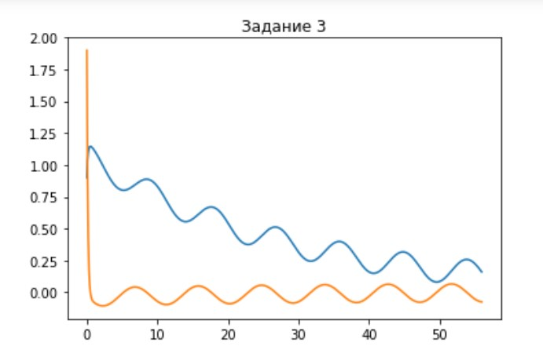{ #fig:017 width=70% }

# Выводы

Я ознакомилась с моделью гармонических колебаний и построила фазовые портреты гармонических колебаний
