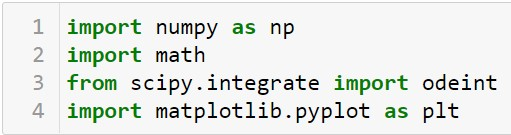
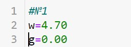
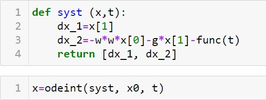
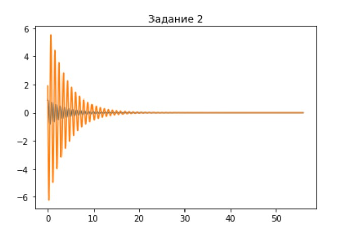
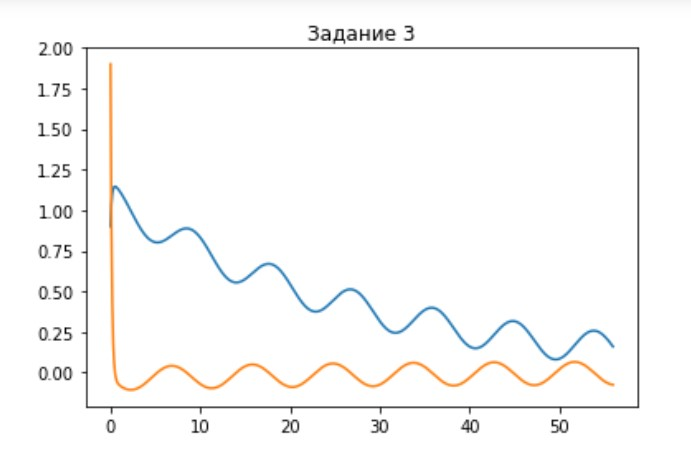

---
# Front matter
lang: ru-RU
title: "Отчет по лабораторной работе №4"
subtitle: "Модель гармонических колебаний"
author: "Голова Варвара Алексеевна"
group: "НФИбд-03-18"
ID: "1032182507"

# Formatting
toc-title: "Содержание"
toc: true # Table of contents
toc_depth: 2
lof: true # List of figures
fontsize: 12pt
linestretch: 1.5
papersize: a4paper
documentclass: scrreprt
polyglossia-lang: russian
polyglossia-otherlangs: english
mainfont: PT Serif
romanfont: PT Serif
sansfont: PT Sans
monofont: PT Mono
mainfontoptions: Ligatures=TeX
romanfontoptions: Ligatures=TeX
sansfontoptions: Ligatures=TeX,Scale=MatchLowercase
monofontoptions: Scale=MatchLowercase
indent: true
pdf-engine: lualatex
header-includes:
  - \linepenalty=10 # the penalty added to the badness of each line within a paragraph (no associated penalty node) Increasing the value makes tex try to have fewer lines in the paragraph.
  - \interlinepenalty=0 # value of the penalty (node) added after each line of a paragraph.
  - \hyphenpenalty=50 # the penalty for line breaking at an automatically inserted hyphen
  - \exhyphenpenalty=50 # the penalty for line breaking at an explicit hyphen
  - \binoppenalty=700 # the penalty for breaking a line at a binary operator
  - \relpenalty=500 # the penalty for breaking a line at a relation
  - \clubpenalty=150 # extra penalty for breaking after first line of a paragraph
  - \widowpenalty=150 # extra penalty for breaking before last line of a paragraph
  - \displaywidowpenalty=50 # extra penalty for breaking before last line before a display math
  - \brokenpenalty=100 # extra penalty for page breaking after a hyphenated line
  - \predisplaypenalty=10000 # penalty for breaking before a display
  - \postdisplaypenalty=0 # penalty for breaking after a display
  - \floatingpenalty = 20000 # penalty for splitting an insertion (can only be split footnote in standard LaTeX)
  - \raggedbottom # or \flushbottom
  - \usepackage{float} # keep figures where there are in the text
  - \floatplacement{figure}{H} # keep figures where there are in the text
---

# Цель работы

Ознакомиться с моделью гармонических колебаний и построить фазовые портреты гармонического осциллятора по этой модели.

# Задание

Вариант 28

Построить фазовый портрет гармонического осциллятора и решение уравнения гармонического осциллятора на интервале $t\in[0;56]$
(шаг $0.05$) с начальными условиями $x_0=0.9, y_0=1.9$ для следующих случаев:
1. Колебания гармонического осциллятора без затуханий и без действий внешней силы $\ddot{x}+4.7x=0$

2. Колебания гармонического осциллятора c затуханием и без действий внешней силы $\ddot{x}+0.5\dot{x}+7x=0$

3. Колебания гармонического осциллятора c затуханием и под действием внешней силы $\ddot{x}+7\dot{x}+0.5x=0.5sin(0.7t)$

#Теоретическая справка
Движение грузика на пружинке, маятника, заряда в электрическом контуре, а
также эволюция во времени многих систем в физике, химии, биологии и других
науках при определенных предположениях можно описать одним и тем же
дифференциальным уравнением, которое в теории колебаний выступает в качестве
основной модели. Эта модель называется линейным гармоническим осциллятором.
Уравнение свободных колебаний гармонического осциллятора имеет
следующий вид:
$$\ddot{x}+2\gamma\dot{x}+\omega_0^2x=0,$$
где x – переменная, описывающая состояние системы (смещение грузика, заряд
конденсатора и т.д.), $\gamma$ – параметр, характеризующий потери энергии (трение в
механической системе, сопротивление в контуре), $\omega_0$
– собственная частота
колебаний, $t$ – время. (Обозначения $\ddot{x}=\frac{\partial^2x}{\partial t^2}$, $\dot{x}=\frac{\partial x}{\partial t}$
)

Данное уравнение - линейное однородное дифференциальное уравнение
второго порядка и оно является примером линейной динамической системы.
При отсутствии потерь в системе ($\gamma=0$
) получаем
уравнение консервативного осциллятора энергия колебания которого сохраняется
во времени.
$$\ddot{x}+\omega_0^2x=0$$
Для однозначной разрешимости уравнения второго порядка необходимо
задать два начальных условия вида
$$\begin{cases}
x(t_o)=x_0\\
\dot{x}(t_0)=y_0
\end{cases}$$

Уравнение второго порядка можно представить в виде системы двух
уравнений первого порядка:
$$\begin{cases}
\dot{x}=y\\
\dot{y}=-\omega_0^2x
\end{cases}$$
Начальные условия для этой системы примут вид:
$$\begin{cases}
x(t_o)=x_0\\
y(t_0)=y_0
\end{cases}$$

Независимые переменные $x$, $y$ определяют пространство, в котором
«движется» решение. Это фазовое пространство системы, поскольку оно двумерно
будем называть его фазовой плоскостью.
Значение фазовых координат $x$, $y$ в любой момент времени полностью
определяет состояние системы. Решению уравнения движения как функции
времени отвечает гладкая кривая в фазовой плоскости. Она называется фазовой
траекторией. Если множество различных решений (соответствующих различным
начальным условиям) изобразить на одной фазовой плоскости, возникает общая
картина поведения системы. Такую картину, образованную набором фазовых
траекторий, называют фазовым портретом.

# Выполнение лабораторной работы

## Библиотеки

Подключаю все необходимые библиотеки(рис. -@fig:001).
{ #fig:001 width=70% }

## Значения
Ввод значений из своего варианта (28 вариант) (рис. -@fig:002).
{ #fig:002 width=70% }

## Задание №1
Ввод параметров осциллятора для задания №1 (рис. -@fig:003).
{ #fig:003 width=70% }

Функция f для задания №1(рис. -@fig:004).
{ #fig:004 width=70% }

Система для задания №1(рис. -@fig:005).
{ #fig:005 width=70% }

## Вывод задания №1
Вывод фазового портрета гармонических колебаний для задания №1(рис. -@fig:006).
{ #fig:006 width=70% }

Вывод решения уравнения гармонического осциллятора для задания №1(рис. -@fig:012).
{ #fig:012 width=70% }

## Задание №2
Ввод параметров осциллятора для задания №2 (рис. -@fig:007).
{ #fig:007 width=70% }

Функция f для задания №2(рис. -@fig:004).
{ #fig:004 width=70% }

Система для задания №2(рис. -@fig:005).
{ #fig:005 width=70% }

## Вывод задания №2
Вывод фазового портрета гармонических колебаний для задания №2(рис. -@fig:008).
{ #fig:008 width=70% }

Вывод решения уравнения гармонического осциллятора для задания №2(рис. -@fig:013).
{ #fig:013 width=70% }

## Задание №3
Ввод параметров осциллятора для задания №3 (рис. -@fig:009).
{ #fig:009 width=70% }

Функция f для задания №3(рис. -@fig:010).
{ #fig:010 width=70% }

Система для задания №3(рис. -@fig:005).
{ #fig:005 width=70% }

## Вывод задания №3
Вывод фазового портрета гармонических колебаний для задания №3(рис. -@fig:011).
{ #fig:011 width=70% }

Вывод решения уравнения гармонического осциллятора для задания №3(рис. -@fig:014).
{ #fig:014 width=70% }

# Выводы

Я ознакомилась с моделью гармонических колебаний и построила фазовые портреты гармонических колебаний
